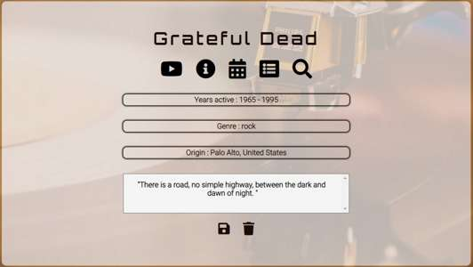
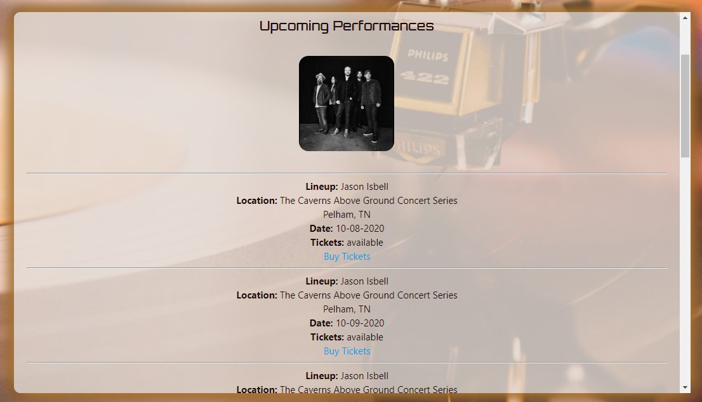
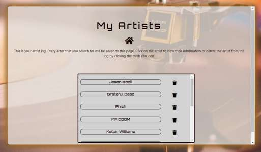

# Pitch:

## Pitch is a music app where users can research new artists via their public profile info, videos on youtube and tour dates.
 
“A deep cut usually refers to non-radio singles by an artist (which tend to be often underplayed), and older songs. Usually 
fans who are really into the artist will know the tracks but not most casual listeners." -Nuhan B. Abid, thedailystar.net 
 
 
Pitch was created by music fans, for music fans. Whether you want to check out a new artist or follow one of your favorites, 
Pitch has compiled all the information you need in one place!
 

### Pitch displays an artist's music video so you can sample their sound.
 Using Googles YouTube API the developers of Pitch are able to provide a sample of the artist's online presence. 
 The API call searches through the API request to filter out channel and playlist search results, providing a  
 reliable return of a single video.
  

 
 ### Learn more about an artist by checking out their info section.
Using Music Brainz Api Pitch will dig deep into the artist's known public profile and inform the user of 
the artist's years active and their place of origin. Additionally, this section acts as a validation of the artist's 
name, being able to work around erroneous spelling and capitalization inputs from the user. 
The info page is also home to a notes section, where users can store custom listening notes about an artist. 
These notes are stored locally and are recalled when that artist's info page is populated again.
 

 ### Want to see a band live? Pitch collects tour dates from artists around the world. 
 Using BandsInTown API Pitch will search for any upcoming performances scheduled for the artist and display them with 
 venue information, location, date and links to buy tickets.
  
 

### Save your favorite bands in the app to easily access them and write down any thoughts you have.
The developers of Pitch created a search history that automatically stores a searched artist name and retrieves it 
the next time the user visits the history section of the app. Familiar with the artist now? Didn't like what you 
heard? No problem. You can remove previous artists with the click of a button.
 

