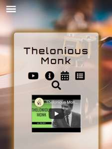

# Pitch:

## Pitch is a music app where users are introduced to new artists via their top songs on youtube, background info, and tour dates.

Pitch was created by music fans, for music fans. Whether you want to check out a new artist or follow one of your favorites, Pitch has compiled all the information you need in one place!

### Pitch displays an artists top  music videos so you can experience their best sound.
 Using googles YouTube API.

 
 ### Learn more about an artist by checking out their info section.
Using Music Brainz Api.
 # imgInfo

 ### Want to see a band live Pitch collects tour dates from artists around the world. 
 Using Bands in Town API.
 # imgtourDates

### Save your favorite bands in the app to easily access them and write down any thoughts you have.
>“A deep cut usually refers to non-radio singles by an artist (which tend to be often >underplayed), and older songs. “ Unknown

